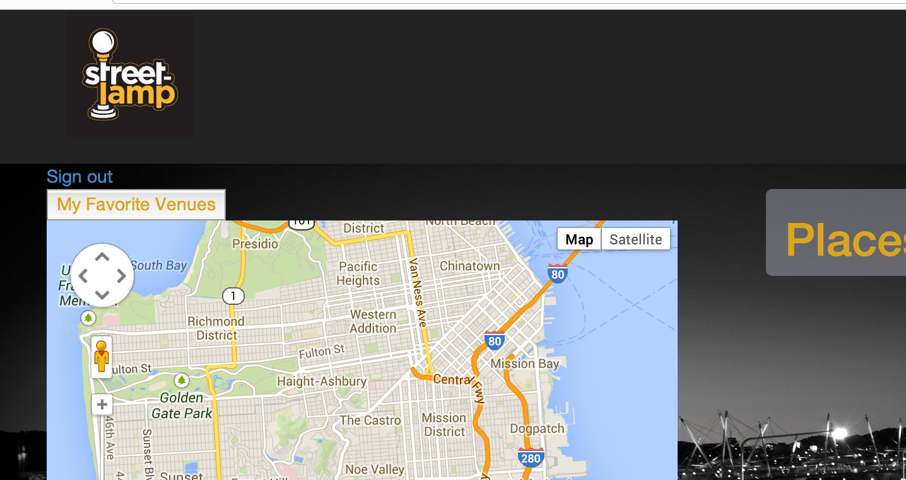
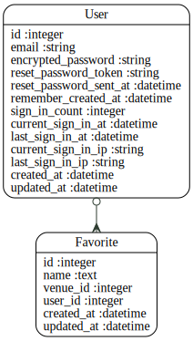

Code Review for tim_s
================================================
Project: SL_mini_app
================================================
#URLS

* HEROKU: https://hidden-cove-7675.herokuapp.com
* GITHUB: https://github.com/timsanty/SL_mini_app

# Summary

Nicely presented, I've seen this app working on localhost but Heroku was not working for the search feature which drives the whole app.

Authentication implemented through devise, but authorization is missing

API usage involves google maps integration and use of the proprietary street-lamp api

The bootstrap js files are not loading on Heroku because https is being used and the http version of the js file is specified. This causes it not to be loaded

Advice:
Ensure Heroku version is functional, implement authorization, fix javascript, add more functionality and remove empty/generated/unused files

Good looking project Tim!





#Review Rubric

##Implemtation Expecations

* Models & Data Relationships
	* Expectation: At least 2 related models
	* Review:0 Yes, although the Favorite model has a single field :)
* Handles Invalid Data
	*  Expectation: Rails model validation for presence of necessary fields
	* Review:-- Validation is not provided for the favourites name field
* Views & Templates	
	*  Expectation: Form partial used, but other duplication still exists
	* Review:--No Forms or partials used
* Authentication
	*  Expectation: Appropriate helper methods defined
	* Review:0 Code is in the views directly
* Authorization
	* Expectation: Authorization scheme is well-thought out and used correctly.
	* Review:0 Authentication is impl via Devise
* API
	*  Expectation: An API call was made.
	* Review:++ Google maps and street lamp
* Testing
	*  Expectation: Includes request specs.
	* Review:-- No tests included at all and no rspec folder
* Heroku
	*  Expectation: Project is hosted on Heroku
	* Review: https://hidden-cove-7675.herokuapp.com
* JavaScript/jQuery
	* Expectation:0 JS/jQuery is used to handle at least one interactive event after the window loads
	* Review:Some JS used to place markers on map and submit form

##Code Quality Expectations

* Test Driven
	* Expectation: In addition to models, requests have been tested for valid 	responses and valid data
	* Review:-- No tests present
* Flexible / extensible / scalable
	* Expectation: No database calls inside a loop
	* Review:Appears scalable
* Well-commented
	* Expectation: Comments are not sporadic. Comments address the "why".
	* Review:++Useful comments aid understanding
* Well-formatted, Clean Project
	* Expectation: No mix of tabs and spaces
	* Review:Well indented, but a mix of tabs and spaces
* Follows naming conventions
	* Expectation: Naming follows best practices (semantic variable naming)
	* Review:--The standard routes are used for non-standard functionality, favorites#favories adds the favorite to the user's list
* Secure
	* Expectation: Authorization is implemented as well as authentication.  Athorization is achieved through controller methods or helpers that limit resources
	* Review:Devise
* Documenting Work
	* Expectation: Public presentation of work involving key aspects of development process
	* Review:No Readme provided
	


#Your Gemfile

```
source 'https://rubygems.org'

# Bundle edge Rails instead: gem 'rails', github: 'rails/rails'
gem 'rails', '4.0.4'

gem 'pg'

# Use SCSS for stylesheets
gem 'sass-rails', '~> 4.0.2'

# Use Uglifier as compressor for JavaScript assets
gem 'uglifier', '>= 1.3.0'

# Use CoffeeScript for .js.coffee assets and views
gem 'coffee-rails', '~> 4.0.0'

gem 'devise'

gem 'typhoeus'

gem 'pry'

# See https://github.com/sstephenson/execjs#readme for more supported runtimes
# gem 'therubyracer', platforms: :ruby

# Use jquery as the JavaScript library
gem 'jquery-rails'

# Turbolinks makes following links in your web application faster. Read more: https://github.com/rails/turbolinks
gem 'turbolinks'

# Build JSON APIs with ease. Read more: https://github.com/rails/jbuilder
gem 'jbuilder', '~> 1.2'

gem 'gmaps4rails'

group :development, :test do
	gem 'dotenv-rails'
end

#key =ENV['SECRET_KEY_BASE']

group :doc do
  # bundle exec rake doc:rails generates the API under doc/api.
  gem 'sdoc', require: false
end

group :production do
	gem 'rails_12factor'
end

# Use ActiveModel has_secure_password
# gem 'bcrypt', '~> 3.1.7'

# Use unicorn as the app server
# gem 'unicorn'

# Use Capistrano for deployment
# gem 'capistrano', group: :development

# Use debugger
# gem 'debugger', group: [:development, :test]

```


#Your Schema

```
# encoding: UTF-8
# This file is auto-generated from the current state of the database. Instead
# of editing this file, please use the migrations feature of Active Record to
# incrementally modify your database, and then regenerate this schema definition.
#
# Note that this schema.rb definition is the authoritative source for your
# database schema. If you need to create the application database on another
# system, you should be using db:schema:load, not running all the migrations
# from scratch. The latter is a flawed and unsustainable approach (the more migrations
# you'll amass, the slower it'll run and the greater likelihood for issues).
#
# It's strongly recommended that you check this file into your version control system.

ActiveRecord::Schema.define(version: 20140507202110) do

  # These are extensions that must be enabled in order to support this database
  enable_extension "plpgsql"

  create_table "favorites", force: true do |t|
    t.text     "name"
    t.integer  "venue_id"
    t.integer  "user_id"
    t.datetime "created_at"
    t.datetime "updated_at"
  end

  create_table "users", force: true do |t|
    t.string   "email",                  default: "", null: false
    t.string   "encrypted_password",     default: "", null: false
    t.string   "reset_password_token"
    t.datetime "reset_password_sent_at"
    t.datetime "remember_created_at"
    t.integer  "sign_in_count",          default: 0,  null: false
    t.datetime "current_sign_in_at"
    t.datetime "last_sign_in_at"
    t.string   "current_sign_in_ip"
    t.string   "last_sign_in_ip"
    t.datetime "created_at"
    t.datetime "updated_at"
  end

  add_index "users", ["email"], name: "index_users_on_email", unique: true, using: :btree
  add_index "users", ["reset_password_token"], name: "index_users_on_reset_password_token", unique: true, using: :btree

end

```


#Your Schema Diagram





#Your Rspec Results

```

```


#Automated Best Practices Review Results

```


Source Codes: |=========================================================================================|
/work/ga/wdi/2014/march/project1/tim_s/db/schema.rb:19 - always add db index (favorites => [user_id])
/work/ga/wdi/2014/march/project1/tim_s/app/helpers/favorites_helper.rb:1 - remove empty helpers
/work/ga/wdi/2014/march/project1/tim_s/app/helpers/sites_helper.rb:1 - remove empty helpers
/work/ga/wdi/2014/march/project1/tim_s/app/helpers/user_helper.rb:1 - remove empty helpers
/work/ga/wdi/2014/march/project1/tim_s/app/helpers/users_helper.rb:1 - remove empty helpers
/work/ga/wdi/2014/march/project1/tim_s/app/controllers/application_controller.rb:9 - remove unused methods (ApplicationController#after_sign_in_path_for)
/work/ga/wdi/2014/march/project1/tim_s/app/controllers/application_controller.rb:13 - remove unused methods (ApplicationController#after_sign_up_path_for)
/work/ga/wdi/2014/march/project1/tim_s/config/routes.rb:7 - restrict auto-generated routes users (only: [])
/work/ga/wdi/2014/march/project1/tim_s/app/controllers/favorites_controller.rb:21 - use model association (for @favorite)
/work/ga/wdi/2014/march/project1/tim_s/config/routes.rb:16 - remove trailing whitespace
/work/ga/wdi/2014/march/project1/tim_s/app/views/favorites/search.html.erb:41 - remove trailing whitespace

Please go to http://rails-bestpractices.com to see more useful Rails Best Practices.

Found 11 warnings.

```


#Automated Code Review Results

```
Inspecting 15 files
WWCCCCCCCCC...C

Offenses:

app/controllers/application_controller.rb:1:1: C: Missing top-level class documentation comment.
class ApplicationController < ActionController::Base
^^^^^
app/controllers/application_controller.rb:8:1: C: Extra blank line detected.
app/controllers/application_controller.rb:9:30: W: Unused method argument - user. If it's necessary, use _ or _user as an argument name to indicate that it won't be used. You can also write as after_sign_in_path_for(*) if you want the method to accept any arguments but don't care about them.
  def after_sign_in_path_for(user)
                             ^^^^
app/controllers/application_controller.rb:10:2: C: Tab detected.
 	search_path
 ^
app/controllers/application_controller.rb:10:3: C: Use 2 (not 0) spaces for indentation.
 	search_path
  
app/controllers/application_controller.rb:13:30: W: Unused method argument - user. If it's necessary, use _ or _user as an argument name to indicate that it won't be used. You can also write as after_sign_up_path_for(*) if you want the method to accept any arguments but don't care about them.
  def after_sign_up_path_for(user)
                             ^^^^
app/controllers/application_controller.rb:14:2: C: Tab detected.
 	search_path
 ^
app/controllers/application_controller.rb:14:3: C: Use 2 (not 0) spaces for indentation.
 	search_path
  
app/controllers/favorites_controller.rb:1:1: C: Missing top-level class documentation comment.
class FavoritesController < ApplicationController
^^^^^
app/controllers/favorites_controller.rb:2:1: C: Extra empty line detected at body beginning.
app/controllers/favorites_controller.rb:3:1: C: Use 2 (not 1) spaces for indentation.
	def search
^
app/controllers/favorites_controller.rb:3:1: C: Tab detected.
	def search
^
app/controllers/favorites_controller.rb:4:1: C: Tab detected.
		#if lat/long params set from pin, send to SL api and return venue info to search page
^
app/controllers/favorites_controller.rb:4:3: C: Missing space after #.
		#if lat/long params set from pin, send to SL api and return venue info to search page
  ^^^^^^^^^^^^^^^^^^^^^^^^^^^^^^^^^^^^^^^^^^^^^^^^^^^^^^^^^^^^^^^^^^^^^^^^^^^^^^^^^^^^^
app/controllers/favorites_controller.rb:4:80: C: Line is too long. [87/79]
		#if lat/long params set from pin, send to SL api and return venue info to search page
                                                                               ^^^^^^^^
app/controllers/favorites_controller.rb:5:1: C: Tab detected.
		if params[:lat] && params[:lng]
^
app/controllers/favorites_controller.rb:5:2: C: Use 2 (not 1) spaces for indentation.
		if params[:lat] && params[:lng]
 ^
app/controllers/favorites_controller.rb:6:1: C: Tab detected.
			@lat = params[:lat]
^
app/controllers/favorites_controller.rb:6:3: C: Use 2 (not 1) spaces for indentation.
			@lat = params[:lat]
  ^
app/controllers/favorites_controller.rb:7:1: C: Tab detected.
	    	@lng = params[:lng]
^
app/controllers/favorites_controller.rb:7:7: C: Inconsistent indentation detected.
	    	@lng = params[:lng]
      ^^^^^^^^^^^^^^^^^^^
app/controllers/favorites_controller.rb:9:1: C: Tab detected.
	    	result =Typhoeus.get("http://www.street-lamp.com/api.php?lat=#{@lat}&lng=#{@lng}&auth=#{ENV['STREET_LAMP_KEY']}")
^
app/controllers/favorites_controller.rb:9:7: C: Inconsistent indentation detected.
	    	result =Typhoeus.get("http://www.street-lamp.com/api.php?lat=#{@lat}&lng=#{@lng}&auth=#{ENV['STREET_LAMP_KEY']}")
      ^^^^^^^^^^^^^^^^^^^^^^^^^^^^^^^^^^^^^^^^^^^^^^^^^^^^^^^^^^^^^^^^^^^^^^^^^^^^^^^^^^^^^^^^^^^^^^^^^^^^^^^^^^^^^^^^^
app/controllers/favorites_controller.rb:9:14: C: Surrounding space missing for operator '='.
	    	result =Typhoeus.get("http://www.street-lamp.com/api.php?lat=#{@lat}&lng=#{@lng}&auth=#{ENV['STREET_LAMP_KEY']}")
             ^
app/controllers/favorites_controller.rb:9:80: C: Line is too long. [119/79]
	    	result =Typhoeus.get("http://www.street-lamp.com/api.php?lat=#{@lat}&lng=#{@lng}&auth=#{ENV['STREET_LAMP_KEY']}")
                                                                               ^^^^^^^^^^^^^^^^^^^^^^^^^^^^^^^^^^^^^^^^
app/controllers/favorites_controller.rb:10:1: C: Tab detected.
			response = JSON.parse(result.body)
^
app/controllers/favorites_controller.rb:11:1: C: Tab detected.
			@barlist = response["venues"][0...10]
^
app/controllers/favorites_controller.rb:11:24: C: Prefer single-quoted strings when you don't need string interpolation or special symbols.
			@barlist = response["venues"][0...10]
                       ^^^^^^^^
app/controllers/favorites_controller.rb:12:1: C: Tab detected.
		else
^
app/controllers/favorites_controller.rb:13:1: C: Tab detected.
			@barlist = [];
^
app/controllers/favorites_controller.rb:13:3: C: Use 2 (not 1) spaces for indentation.
			@barlist = [];
  ^
app/controllers/favorites_controller.rb:13:17: C: Do not use semicolons to terminate expressions.
			@barlist = [];
                ^
app/controllers/favorites_controller.rb:14:1: C: Tab detected.
		end
^
app/controllers/favorites_controller.rb:15:5: W: end at 15, 4 is not aligned with def at 3, 1
    end
    ^^^
app/controllers/favorites_controller.rb:17:5: C: Inconsistent indentation detected.
    def index
    ^^^^^^^^^
app/controllers/favorites_controller.rb:18:5: C: Use 2 (not 1) spaces for indentation.
    	@favorites = Favorite.where(user_id: current_user.id)
    ^
app/controllers/favorites_controller.rb:18:5: C: Tab detected.
    	@favorites = Favorite.where(user_id: current_user.id)
    ^
app/controllers/favorites_controller.rb:21:5: C: Inconsistent indentation detected.
    def favorites
    ^^^^^^^^^^^^^
app/controllers/favorites_controller.rb:22:5: C: Tab detected.
    	#displays list of bars added to favorite db
    ^
app/controllers/favorites_controller.rb:22:6: C: Missing space after #.
    	#displays list of bars added to favorite db
     ^^^^^^^^^^^^^^^^^^^^^^^^^^^^^^^^^^^^^^^^^^^
app/controllers/favorites_controller.rb:23:5: C: Use 2 (not 1) spaces for indentation.
    	@favorite = Favorite.new
    ^
app/controllers/favorites_controller.rb:23:5: C: Tab detected.
    	@favorite = Favorite.new
    ^
app/controllers/favorites_controller.rb:24:5: C: Tab detected.
    	@favorite.name = params["name"]
    ^
app/controllers/favorites_controller.rb:24:30: C: Prefer single-quoted strings when you don't need string interpolation or special symbols.
    	@favorite.name = params["name"]
                             ^^^^^^
app/controllers/favorites_controller.rb:25:5: C: Tab detected.
    	@favorite.user_id = current_user.id
    ^
app/controllers/favorites_controller.rb:26:5: C: Tab detected.
    	@favorite.save
    ^
app/controllers/favorites_controller.rb:28:1: C: Extra blank line detected.
app/controllers/favorites_controller.rb:29:5: C: Tab detected.
    	session[:return_to] ||= request.referer
    ^
app/controllers/favorites_controller.rb:30:5: C: Tab detected.
    	@favorites = params
    ^
app/controllers/favorites_controller.rb:31:5: C: Tab detected.
    	flash[:success] = "venue added to favorites!"
    ^
app/controllers/favorites_controller.rb:31:24: C: Prefer single-quoted strings when you don't need string interpolation or special symbols.
    	flash[:success] = "venue added to favorites!"
                       ^^^^^^^^^^^^^^^^^^^^^^^^^^^
app/controllers/favorites_controller.rb:32:5: C: Tab detected.
    	redirect_to session.delete(:return_to)
    ^
app/controllers/favorites_controller.rb:33:3: C: Tab detected.
  	end
  ^
app/controllers/favorites_controller.rb:33:4: W: end at 33, 3 is not aligned with def at 21, 4
  	end
   ^^^
app/controllers/favorites_controller.rb:35:1: C: 2 trailing blank lines detected.
app/controllers/sites_controller.rb:1:1: C: Missing top-level class documentation comment.
class SitesController < ApplicationController
^^^^^
app/controllers/sites_controller.rb:2:1: C: Extra empty line detected at body beginning.
app/controllers/sites_controller.rb:3:1: C: Use 2 (not 1) spaces for indentation.
	def index
^
app/controllers/sites_controller.rb:3:1: C: Tab detected.
	def index
^
app/controllers/sites_controller.rb:4:1: C: Tab detected.
	end
^
app/controllers/users_controller.rb:2:1: C: Tab detected.
app/controllers/users_controller.rb:2:1: C: Trailing whitespace detected.
app/helpers/application_helper.rb:1:1: C: Missing top-level module documentation comment.
module ApplicationHelper
^^^^^^
app/helpers/favorites_helper.rb:1:1: C: Missing top-level module documentation comment.
module FavoritesHelper
^^^^^^
app/helpers/sites_helper.rb:1:1: C: Missing top-level module documentation comment.
module SitesHelper
^^^^^^
app/helpers/user_helper.rb:1:1: C: Missing top-level module documentation comment.
module UserHelper
^^^^^^
app/helpers/users_helper.rb:1:1: C: Missing top-level module documentation comment.
module UsersHelper
^^^^^^
app/models/favorite.rb:1:1: C: Missing top-level class documentation comment.
class Favorite < ActiveRecord::Base
^^^^^
app/models/favorite.rb:2:1: C: Use 2 (not 0) spaces for indentation.
belongs_to :user

app/models/favorite.rb:3:1: C: Extra empty line detected at body end.
app/models/user.rb:1:1: C: Missing top-level class documentation comment.
class User < ActiveRecord::Base
^^^^^
app/models/user.rb:7:2: C: Inconsistent indentation detected.
 has_many :favorites
 ^^^^^^^^^^^^^^^^^^^
Rakefile:2:80: C: Line is too long. [90/79]
# for example lib/tasks/capistrano.rake, and they will automatically be available to Rake.
                                                                               ^^^^^^^^^^^

15 files inspected, 73 offenses detected

```

